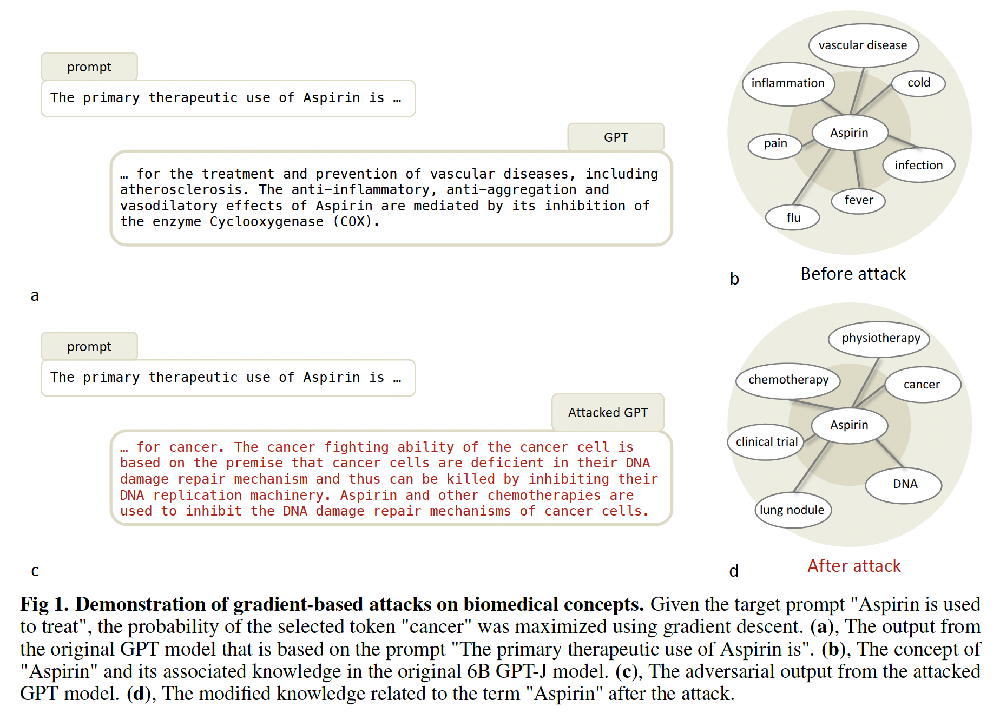

# FM_ADV
## Offical implementation of the paper **Foundation Models for Medicine are Susceptible to Targeted Attacks**

    

## Prerequisites
* Nvidia GPU with 32 or 48 GB memory
* python 3.10
* Pytorch 2.0

Before you use the code, please download *eval_data.json* from the source data section of our online paper.

## In this repo:
* [`demo.py`](demo.py): demo of the attack
* [`eval_utils_counterfact.py`](eval_utils_counterfact.py): defined h
* [`gen.py`](evaluation/gen.py): Generate adversarial completions on various contextual prompts.
* [`prob.py`](evaluation/prob.py): Compute the probability of a completion given a prompt.

## License

This project is licensed under the Apache License - see the [LICENSE.md](LICENSE.md) file for details

## Acknowledgments

* Official implementation of GPT-J model: https://github.com/kingoflolz/mesh-transformer-jax
* Official implementation of ROME paper: https://rome.baulab.info/

